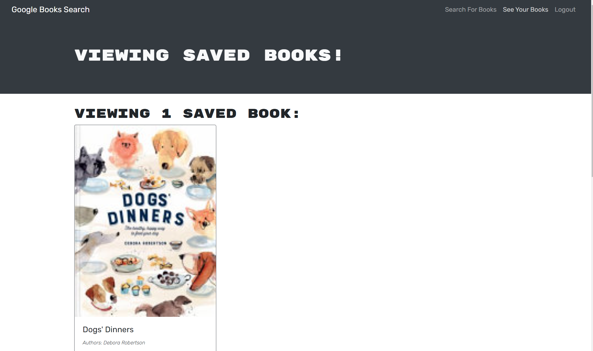

# Book-search-engine

[](https://opensource.org/licenses/MIT)

## Description

This application was provided as a fully functioning Google Books API search engine built with a RESTful API. It has been refactored to now use a GraphQL API built with Apollo Server. The app was built using the MERN stack with a React front end, MongoDB database, and Node.js/Express.js server and API. It allows users to save book searches to the back end. 

Link to the Heroku application for "Google Book Engine": [view app](https://agile-anchorage-64986.herokuapp.com/).

## Table of Contents

- [Installation](#installation)
- [Usage](#usage)
- [License](#license)
- [Contributing](#contributing)
- [Credits](#credits)
- [Tests](#tests)
- [Questions](#questions)

## Installation

Clone these files from the GitHub repository via your preferred means. Then make sure to install necessary dependencies by running the following commands:

```
npm install
```

## Usage

Once the files have been pull down to your preferred repository, run this application by inputting 'npm start' into your bash terminal for the client and the server. The server will start. You can then view the application in the default browser.




## License

This project is licensed by the [MIT](https://opensource.org/licenses/MIT) license

## Contributing

If this project is of interest to you, please contact me with a detailed description of how you would like to contribute prior to any pull requests.

## Credits


https://www.npmjs.com/package/nodemon

https://www.npmjs.com/package/express-session

https://www.npmjs.com/package/dotenv

https://www.npmjs.com/package/connect-session-sequelize

https://www.mongodb.com/

https://devcenter.heroku.com/categories/reference

https://www.npmjs.com/package/graphql

https://www.apollographql.com/docs/react/

https://www.npmjs.com/package/if-env

## Tests

There are currently no tests for this application.

## Questions

If you have any questions or require further clarification then please contact me at:

- https://github.com/Shelbyrp/
- shelby.pignat@gmail.com


